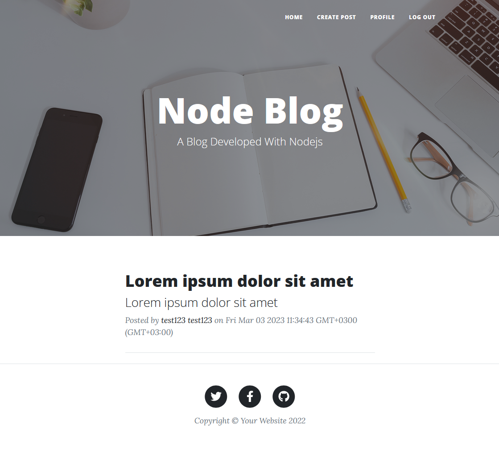
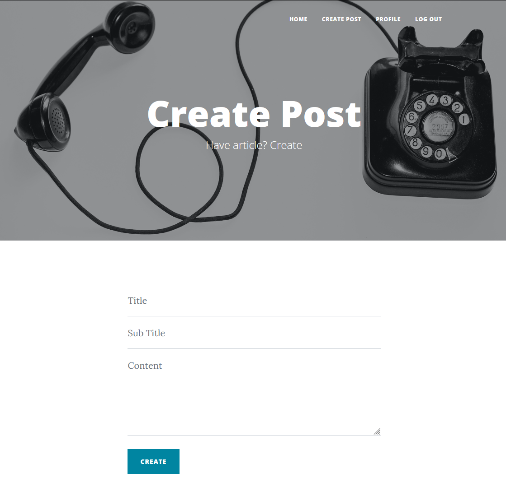

# Server Side Prototype Pollution

This website has been developed using Nodejs and has a server side prototype pollution vulnerability vulnerability.

### Requirements:

1. Npm
1. Node Js
1. MySQL


#### You can install this website in two different ways:
1. NPM Node JS and MySQL installations by hand
1. With Docker Compose


## Docker Compose Installation
1. Get docker-compose.yml file in repository
1. Run this command: 
```shell
docker compose -f docker-compose.yml up -d
```
1. Go to ```localhost:4111/install``` (If you change the port and host information manually, you must move accordingly).

## Manual Installation
1. Clone repository 
```shell 
git clone https://github.com/Serhatcck/server-side-prototype-pollution.git
```
2. 
```shell
cd server-side-prototype-pollution
```
3. İnstall all packages
```shell
npm install
```
1. Create MYSQL server
1. Configure db connection with `configs/db` file or environment value:
    1. host
    1. user
    1. password
    1. database
1. Start App
```shell
node app.js
```
1. Go to ```localhost:4111/install``` (If you change the port and host information manually, you must move accordingly).
    
## Images



